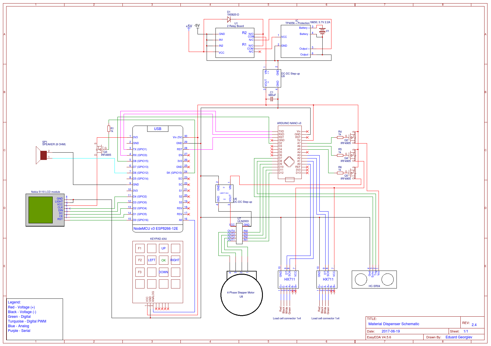

# Bulk Delivery System (Cat Feeder)

*This Bulk Delivery System is my dissertation for the Technical University of Sofia. The system was implemented as a cat feeder for the demonstration. It is currently written in Bulgarian and I have not translated it in English yet. Play the file Demo.mp4 for a brief demonstration.*

## Main Elements

1. Arduino
2. Ultrasound Sensor
3. Stepper motor
4. Strain gauge
5. NodeMCU
6. Nokia 5110 display
7. TP4056 charging module

| Software |
| --- |
| Visual Studio |
| Arduino |
| Notepad++	|
| Microsoft Word |
| EasyAda.com |

## Electrical scheme

## Used Languages

| Languages |
| --- |
|C / C++|

## References

Available in the documentation.
Note that some of the sources and code used in this project might have a license different than the one in the repository, check every source and reference before implementing parts of it in your own code.
